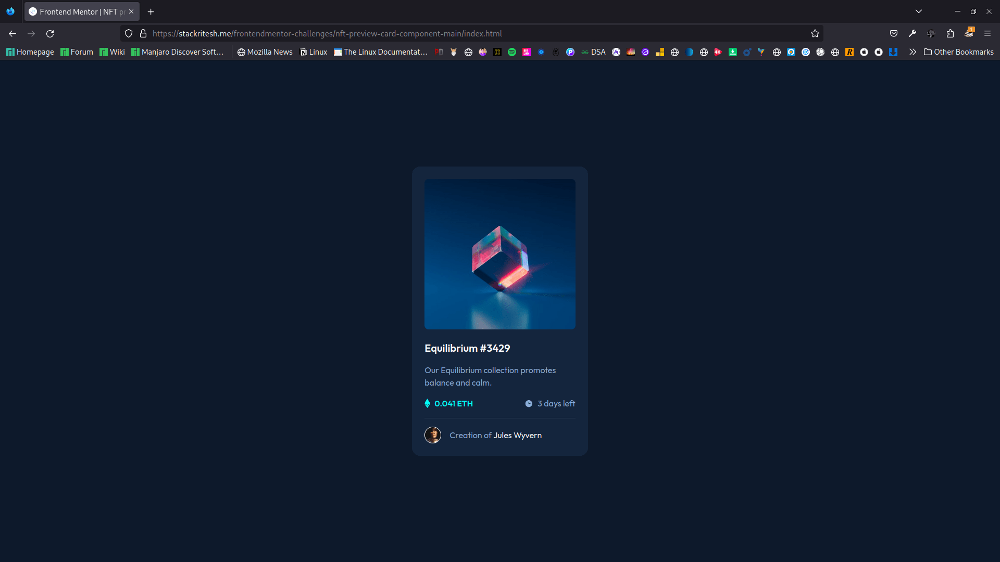
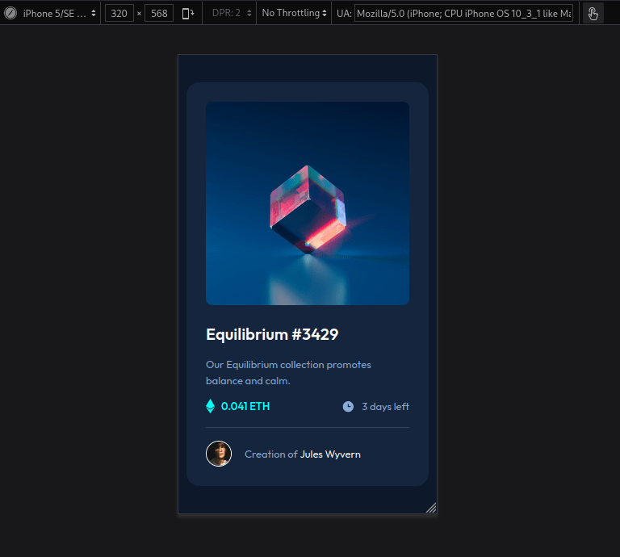
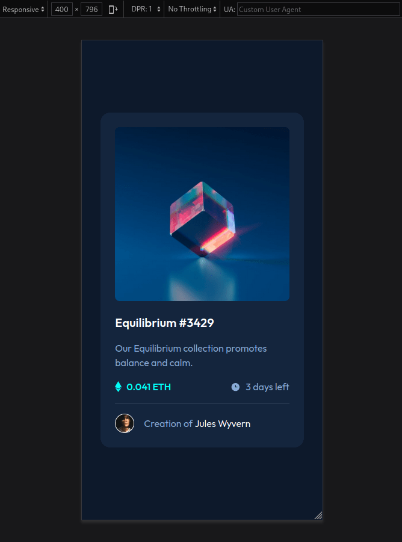

# Frontend Mentor - NFT preview card component solution

This is a solution to the [NFT preview card component challenge on Frontend Mentor](https://www.frontendmentor.io/challenges/nft-preview-card-component-SbdUL_w0U). Frontend Mentor challenges help you improve your coding skills by building realistic projects. 

## Table of contents

- [Overview](#overview)
  - [The challenge](#the-challenge)
  - [Screenshot](#screenshot)
  - [Links](#links)
- [My process](#my-process)
  - [Built with](#built-with)
  - [What I learned](#what-i-learned)
  - [Continued development](#continued-development)
  - [Useful resources](#useful-resources)
- [Author](#author)
- [Acknowledgments](#acknowledgments)

## Overview

### The challenge

Users should be able to:

- View the optimal layout depending on their device's screen size
- See hover states for interactive elements

### Screenshot
**Desktop View**

**Mobile View**

### Links

- Solution URL: [View](https://www.frontendmentor.io/solutions/responsive-nft-preview-card-component-DpX3wwT3yY)
- Live Site URL: [Visit](https://git-ritesh.github.io/frontendmentor-challenges/nft-preview-card-component-main/index.html)

## My process

1. Broke the layout into horizontal & vertical divs. 
2. Made the layout and style them.
3. created an `img-wrapper` div, placed an `` inside and added an `::after` pseudo classe for adding overlay view-icon when we `hover` over the image.
4. added `::before` pseudo class to add icons and made that `display:flex;` for aligning it to center.
5. Rest was easy for me. 

### Built with

- Semantic HTML5 markup
- CSS custom properties
- Flexbox
- CSS Grid
- CSS Position
- Mobile-first workflow

### What I learned

- We can create overlay using `padding` and `background`.
- Another Method is to use `position: absolute;`for the overlay and use `display: flex;` for aligning the content inside the overlay.
- Best Approach is to use the Pseudo classes `::before` & `::after` for adding content instead of adding elements to html for the overlays.
- For aligning the pseudo elements you've to make it `display: flex;` to align it with the text.

### Continued development

- I want to explore more about how `::before` & `::after` work in different scenarios. 

- What are the things that needs to be kept in mind while using these type of properties.

### Useful resources

- [How to create an overlay Icon ? ](https://www.w3schools.com/howto/howto_css_image_overlay_icon.asp) - This helped me to understand how I can create overlay using better methods.

- [Unused Use Cases for Pseudo Elements](https://ishadeed.com/article/unusual-use-cases-pseudo-elements/) - This article contains some of the usecases of pseudo elements whic are not often used while it can come in handy.

## Author
- Website - [stackritesh.me](https://stackritesh.me/)
- Frontend Mentor - [@git-ritesh](https://www.frontendmentor.io/profile/git-ritesh)
- Twitter - [@shadowlurk3r](https://www.twitter.com/shadowlurk3r)

## Acknowledgments

[@sankalp475](https://github.com/sankalp475) helped me to improve my project to reduce code & make my webpage efficient.

