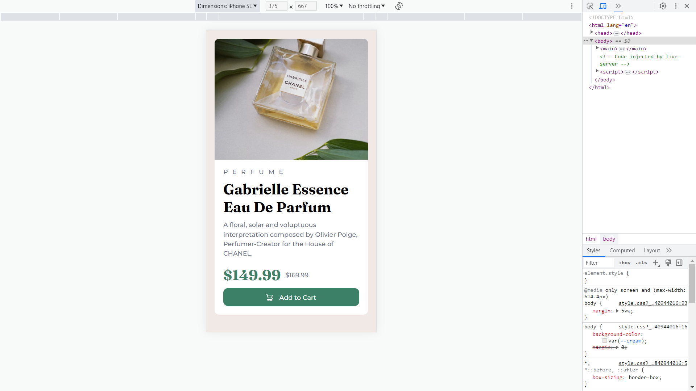

# Frontend Mentor - Product preview card component solution

This is a solution to the [Product preview card component challenge on Frontend Mentor](https://www.frontendmentor.io/challenges/product-preview-card-component-GO7UmttRfa). Frontend Mentor challenges help you improve your coding skills by building realistic projects. 

## Table of contents

- [Overview](#overview)
  - [The challenge](#the-challenge)
  - [Screenshot](#screenshot)
  - [Links](#links)
  - [Built with](#built-with)
  - [What I learned](#what-i-learned)
  - [Continued development](#continued-development)
  - [Useful resources](#useful-resources)
- [Author](#author)
- [Acknowledgments](#acknowledgments)

## Overview

### The challenge

Your challenge is to build out this product preview card component and get it looking as close to the design as possible.

You can use any tools you like to help you complete the challenge. So if you've got something you'd like to practice, feel free to give it a go.

Your users should be able to:

- View the optimal layout depending on their device's screen size
- See hover and focus states for interactive elements

Want some support on the challenge? [Join our Slack community](https://www.frontendmentor.io/slack) and ask questions in the **#help** channel.

### Screenshots

**Desktop View**

**Mobile View**

### Links

- Solution URL : [View](https://www.frontendmentor.io/solutions/product-preview-card-component-using-flexbox-SqAqgGGUB_)
- Live Site URL: [View Webpage](https://stackritesh.me/frontendmentor-challenges/product-preview-card-component-main/index.html)

### Built with

- Semantic HTML5 markup
- CSS custom properties
- Flexbox
- Media Queries

### What I learned

- Flexbox can help you in making a very responsive and beautiful layouts with ease. 

- Flex-items shrink themselves to a minimum size they can possibly get. 

- Media Query is an essential part in making the Webpage Responsive. 

- If you give `width: 100%;` to a `flex-item` it will try to take up the maximum size it can get in the `flex-container`. 

- By default the Flexbox doesn't wraps the flex-items. 

### Continued development

1. **Flexbox** : Though I've used Flexbox in this project but I'm still not familiar with all the things which revolve around flexbox. So I'm gonna focus on getting a dedper knowledge of flexbox for apply them in future projects.

2. **Media Queries** : This is my first project in which i used Media Query for making Responsive Page and it felt a little bit complex to grasp a full understanding of Media Queries. So I'm gonna take a deeper dive into it also.

### Useful resources

- [Flexbox Basics](https://youtube.com/playlist?list=PL4-IK0AVhVjMSb9c06AjRlTpvxL3otpUd) - This Youtube Playlist by [Kevin Powell](https://twitter.com/KevinJPowell) helped me understanding the Basics of Flexbox. I really liked how he explained the Properties and the use of them in creating layouts. 

- [A Guide to flexbox](https://css-tricks.com/snippets/css/a-guide-to-flexbox/) - This is an amazing article which contains a complete guide with some flexbox tricks and Describes the concepts with illustrated examples which makes it easier to understand.

- Some more resources : [w3Schools Reference](https://www.w3schools.com/css/css3_flexbox.asp) &bull; [MDN Reference](https://developer.mozilla.org/en-US/docs/Web/CSS/CSS_flexible_box_layout/Basic_concepts_of_flexbox)

## Author
- Website - [stackritesh.me](https://stackritesh.me/)
- Frontend Mentor - [@git-ritesh](https://www.frontendmentor.io/profile/git-ritesh)
- Twitter - [@shadowlurk3r](https://www.twitter.com/shadowlurk3r)
