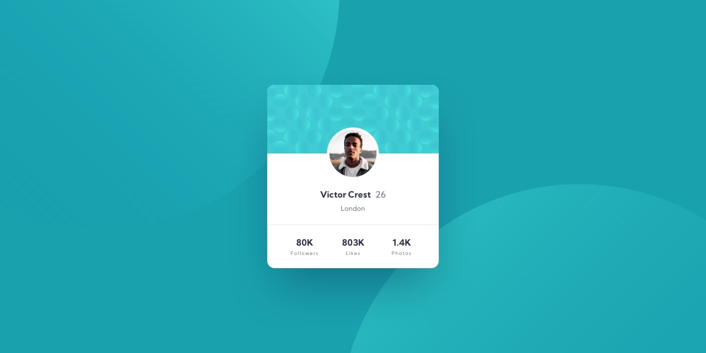

# Frontend Mentor - Profile card component solution

This is a solution to the [Profile card component challenge on Frontend Mentor](https://www.frontendmentor.io/challenges/profile-card-component-cfArpWshJ). Frontend Mentor challenges help you improve your coding skills by building realistic projects. 

## Table of contents

- [Overview](#overview)
  - [The challenge](#the-challenge)
  - [Screenshot](#screenshot)
  - [Links](#links)
- [My process](#my-process)
  - [Built with](#built-with)
  - [What I learned](#what-i-learned)
  - [Continued development](#continued-development)
- [Author](#author)
- [Acknowledgments](#acknowledgments)

## Overview

### The challenge

- Build out the project to the designs provided

### Screenshot
**Desktop Design** 


<aside align='right'><b>Mobile Design</b></aside>


### Links

- Solution URL: [Add solution URL here](https://your-solution-url.com)
- Live Site URL: [Add live site URL here](https://your-live-site-url.com)

<h2>My process</h2>

### Built with

- Semantic HTML5
- CSS custom properties
- Flexbox
- Mobile-first workflow

### What I learned

#### Multiple Backgrounds & its properties : 
- How we can add multiple backgrounds in `body` or any other element and use its properties.
Following code snippet is the example : 
```css
body {
    margin: 0;
    background: hsl(185, 75%, 39%);
    background-image: url(images/bg-pattern-top.svg), url(images/bg-pattern-bottom.svg);
    background-position: right 50vw bottom 35vh, left 50vw top 50vh;
    background-repeat: no-repeat, no-repeat;
}
```
- As you can see we can use multiple backgrounds just by putting commas, b/w them and for giving the background properties like `background-size`, `background-position`, `background-repeat`& `background-attachment` etc. we use the same thing.

### Continued development

- Grid 
- Transform
- CSS Position

## Author

- Website - [stackritesh.me](https://www.stackritesh.me/)
- Frontend Mentor - [@git-ritesh](https://www.frontendmentor.io/profile/git-ritesh)
- Twitter - [@shadowlurk3r](https://www.twitter.com/shadowlurk3r)

## Acknowledgements 

[Sankalp](https://github.com/sankalp475) helped me to improve and refine my project.