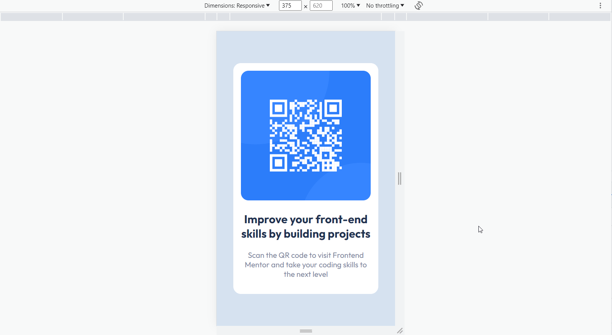
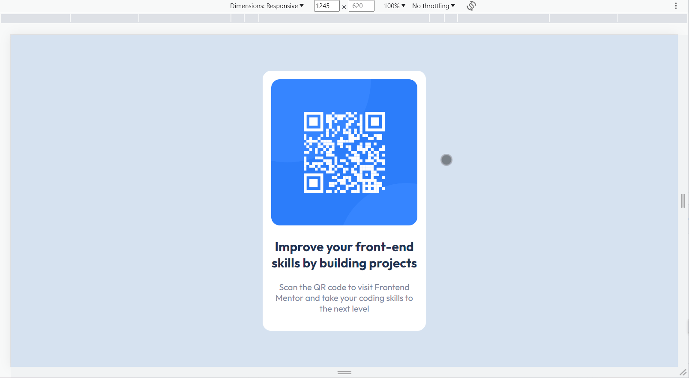

# Frontend Mentor - QR code component solution

This is a solution to the [QR code component challenge on Frontend Mentor](https://www.frontendmentor.io/challenges/qr-code-component-iux_sIO_H). Frontend Mentor challenges help you improve your coding skills by building realistic projects. 

## Table of contents

- [Overview](#overview)
  - [Screenshot](#screenshot)
  - [Links](#links)
- [My process](#my-process)
  - [Built with](#built-with)
  - [What I learned](#what-i-learned)
  - [Continued development](#continued-development)
- [Author](#author)

## Overview

QR Code Component Responsive challenge is a very basic challenge in which you have to create a component which contains a QR Code, Heading & paragraph. it looks like a small card design.

### Screenshot

#### Mobile Preview

#### Desktop Preview 

### Links

- Solution URL: [View](https://www.frontendmentor.io/solutions/responsive-qr-code-component-MFDbdX6DxU)
- Live Site URL: [Live Webpage](https://git-ritesh.github.io/frontendmentor-challenges/qr-code-component-main/index.html)

## My process

- Broke the layout into vertical & horizontal Nested Layouts.

- Created containers for holding images and text inside it.

- A parent container for holding all the containers. 

- set the display of the `<main>` to `flex` to vertically center the component.

### Built with

- Semantic HTML5 markup
- CSS custom properties
- Flexbox
- Mobile-first workflow

### What I learned

This was the first ever mobile-first approach I followed to make something. Though this was a pretty basic challenge to do. Still I learned how we can make responsive things without using Media Queries & avoid writing so many properties for a single element over & over for different screen sizes.

### Continued development

How we can take the approach of making things responsive without too many complexities.

## Author
- Frontend Mentor - [@git-ritesh](https://www.frontendmentor.io/profile/git-ritesh)
- Twitter - [@sanatanispirit](https://www.twitter.com/sanatanispirit)