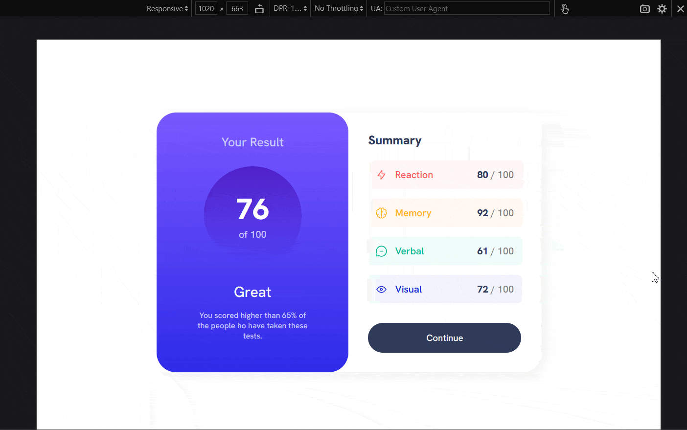

# Frontend Mentor - Results summary component solution

This is a solution to the [Results summary component challenge on Frontend Mentor](https://www.frontendmentor.io/challenges/results-summary-component-CE_K6s0maV). Frontend Mentor challenges help you improve your coding skills by building realistic projects. 

## Table of contents

- [Overview](#overview)
  - [The challenge](#the-challenge)
  - [Screenshot](#screenshot)
  - [Links](#links)
- [My process](#my-process)
  - [Built with](#built-with)
  - [What I learned](#what-i-learned)
  - [Continued development](#continued-development)
  - [Useful resources](#useful-resources)
- [Author](#author)

## Overview

A Results Summary Component containing Two Cards which have : 

1. Overall score & Rank & description based upon that.

2. Summary result for each topic in which the score is obtained.

### The challenge

Your challenge is to build out this results summary component and get it looking as close to the design as possible.

You can use any tools you like to help you complete the challenge. So if you've got something you'd like to practice, feel free to give it a go.

We provide the data for the results in a local `data.json` file. So you can use that to add the results and total score dynamically if you choose.

**Users should be able to:**

- View the optimal layout for the interface depending on their device's screen size
- See hover and focus states for all interactive elements on the page
- **Bonus**: Use the local JSON data to dynamically populate the content

### Screenshot

**Mobile Design**

**Desktop Design**

**My Results Summary Solution Preview**

### Links

- Solution URL: [Add solution URL here](https://your-solution-url.com)

- Live Site URL: [Visit](https://git-ritesh.github.io/frontendmentor-challenges/results-summary-component-main/index.html)

## My process

#### Followed Mobile First Approach
_Mobile Design :_
- Created two cards layout with equal `width` and `padding`. 
- Added contents in it like `<h1>`, `
` & `
`(for the circle scorecard.)
- wrapped up both cards into `<main>` for centering the content.
_Desktop Design :_
- set the `.main` to `display: flex;` for making the cards stacked side by side.
- added `box-shadow` for giving shadow to the `<main>` 

Boom Done !!

### Built with

- Semantic HTML5 markup
- CSS custom properties
- Flexbox
- Mobile-first workflow

### What I learned

While I made this project, I learned about how things work in Mobile First Workflow.

### Continued development

Though I'm quite familiar with Flexbox. But I've not done made my hands dirty with CSS Grid. 
So I'd Like to explore & learn more about Grid, So that I can use also use Grid for making Responsive Layouts. 

### Useful resources

 [Learn Grid](https://mozilladevelopers.github.io/playground/css-grid) - Awesome resource for learning Grid by Mozilla developer Network.

## Author
- Frontend Mentor - [@git-ritesh](https://www.frontendmentor.io/profile/git-ritesh)
- Twitter - [@stack_spirit](https://www.twitter.com/stack_spirit)

